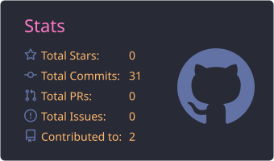
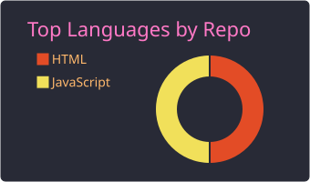

<h2 align="left">Hi 👋! My name is Samuel Pinton and I'm an AI Engineer</h2>

###

  I work with AI automation using n8n and Langflow.
   
  I'm currently studying Systems Analysis and Development at Claretiano.
   
  I'm focused on artificial intelligence, automation, workflows and web development.

###

  
  

###

###

<h3 align="left">🛠️ Languages and tools</h3>

  
  

  
  

  
  

  
  

  
  

  
  

  
  

  

###

<h3 align="left">📚 Currently learning</h3>

<ul align="left">
  <li>Systems Analysis and Development at Claretiano</li>
  <li>AI automation with n8n and Langflow</li>
  <li>JavaScript</li>
  <li>C language</li>
  <li>HTML and CSS</li>
  <li>Git and GitHub</li>
</ul>

###

<h3 align="left">📫 Connect with me</h3>

  

  

###

 

###
